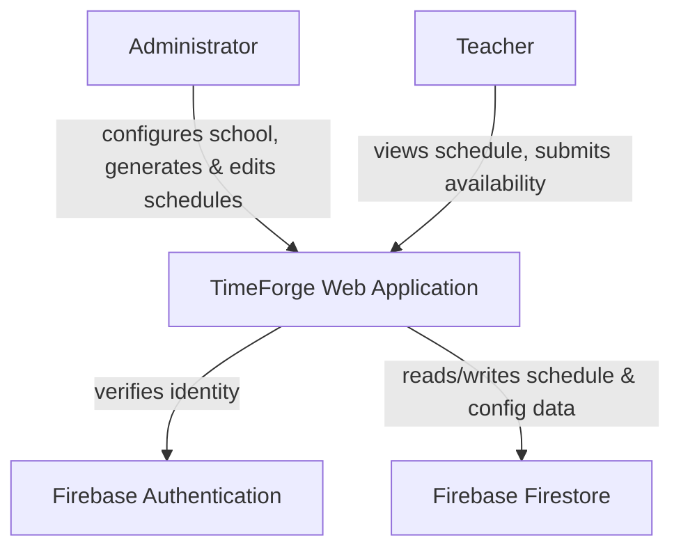
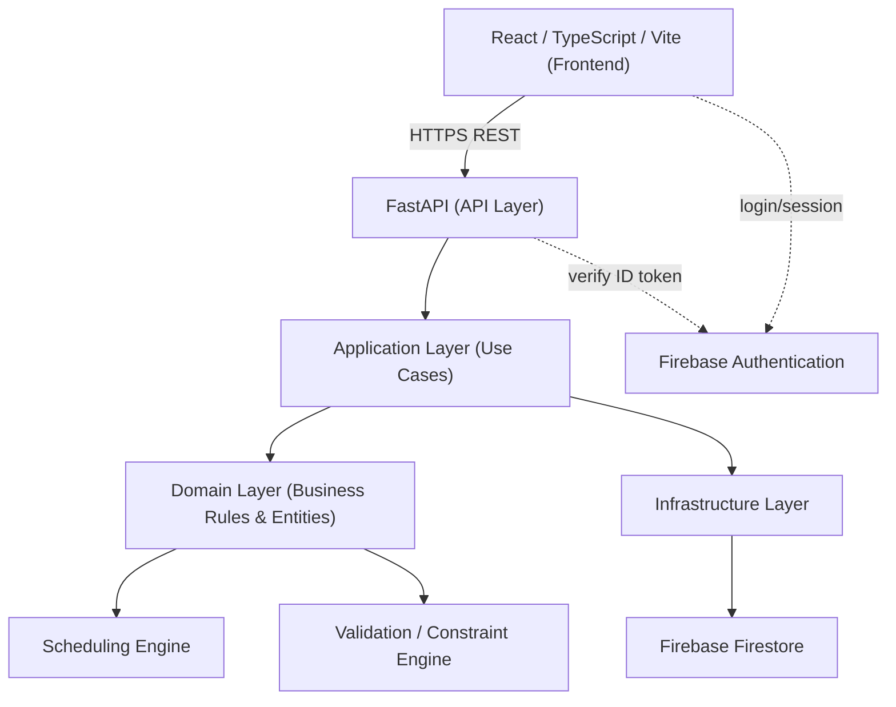
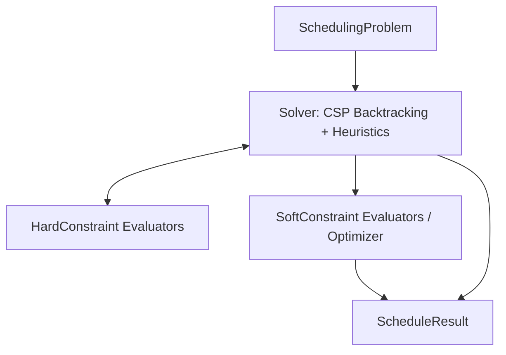
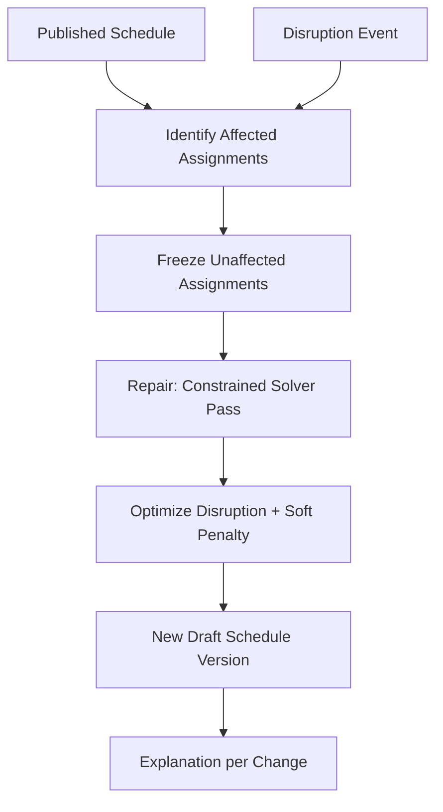
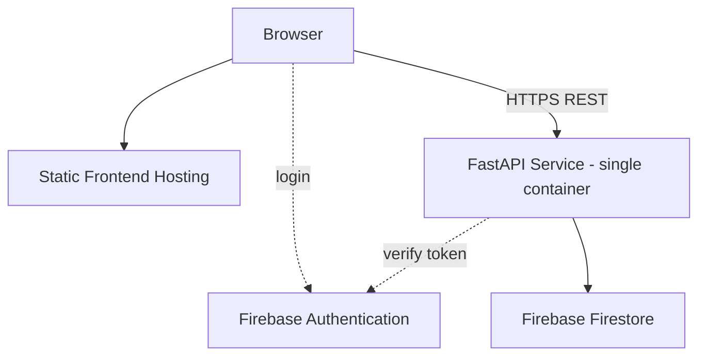

# 03-ARCHITECTURE.md — Software Architecture Document

## 1. Architecture Goals

- Isolate the scheduling domain (constraints, solver, rescheduling) from web/framework/database concerns so it is independently testable and explainable.
- Keep the system implementable and defensible by a single developer within a final-project timeline — favor a modular monolith over distributed infrastructure.
- Make every automatic decision explainable and every mutation auditable.
- Guarantee hard constraints are enforced at a single, reused choke point (not duplicated across generation/rescheduling/manual-edit paths).

## 2. Architecture Principles

1. **Dependency inversion around the domain.** The domain and scheduling engine depend on nothing outside themselves; infrastructure depends on the domain, never the reverse.
2. **One authoritative rule set.** Hard/soft constraints are evaluated by one shared engine used by generation, rescheduling, and manual-move validation.
3. **Explicit boundaries.** API layer, application layer, domain layer, infrastructure layer each have a single clear responsibility (see §9–12).
4. **Modular monolith, not microservices**, unless a specific, documented scaling need arises (none identified for this project's scale — see §36).
5. **Explainability is a first-class output**, not an afterthought — every engine result carries structured reasoning, not just a boolean.

## 3. System Context

TimeForge is a single web application used by school staff (administrators, teachers) through a browser. It depends on Firebase (Authentication + Firestore) as its only external managed service.



## 4. External Actors

- **Administrator** — full configuration and scheduling authority.
- **Teacher** — read access to own schedule; write access to own availability/preferences.

## 5. External Systems

- **Firebase Authentication** — identity provider, issues ID tokens verified by the backend.
- **Firebase Firestore** — sole persistent data store.

No other external system is integrated in MVP.

## 6. High-Level Architecture



## 7. Logical Architecture

Four layers, strictly one-directional dependency (top depends on layer below, never the reverse):

1. **API Layer** (`backend/app/api`) — HTTP concerns only: routing, request/response models, auth extraction.
2. **Application Layer** (`backend/app/application`) — use cases/services orchestrating domain objects and repositories; owns transaction boundaries.
3. **Domain Layer** (`backend/app/domain`) — entities, value objects, constraints, the scheduling engine, the rescheduling engine, domain services. No knowledge of HTTP or Firestore.
4. **Infrastructure Layer** (`backend/app/infrastructure`) — Firestore repository implementations, Firebase Admin SDK wiring, logging setup.

Repository **interfaces** are defined in the domain/application layer; **implementations** live in infrastructure and are injected — this is the one place dependency inversion is essential (Rule 2/3 in [01-CLAUDE.md](01-CLAUDE.md)).

## 8. Frontend Architecture

```text
frontend/src/
├── app/            # app shell, routing, providers
├── pages/          # route-level screens (Dashboard, Timetable, Management, ...)
├── features/       # feature-scoped logic+components (scheduling, rescheduling, availability, ...)
├── components/     # shared/presentational components
├── hooks/          # reusable React hooks
├── services/       # API client wrappers (typed fetch), Firebase Auth wrapper
├── types/          # shared TypeScript types (mirroring backend Pydantic response models)
└── state/          # scoped state (currently just auth) — see §9 "Frontend State" in 07-CODE_STANDARDS.md
```

The frontend calls the backend exclusively through `services/` API clients typed against the backend's response models. It never talks to Firestore for business data (§9, [01-CLAUDE.md](01-CLAUDE.md) rule 6).

## 9. Backend Architecture

```text
backend/app/
├── api/                 # FastAPI routers, request/response schemas
├── application/          # use-case services (ScheduleGenerationService, ReschedulingService, ...)
├── domain/
│   ├── models/           # entities & value objects
│   ├── constraints/       # HardConstraint / SoftConstraint implementations
│   ├── scheduling/        # SchedulingProblem, Solver, ScheduleResult
│   ├── rescheduling/      # ReschedulingEngine, disruption cost model
│   └── services/          # domain services (conflict detection, explanation building)
├── infrastructure/
│   ├── firebase/          # Firebase Admin SDK client setup, auth verification
│   └── repositories/      # Firestore repository implementations
└── core/                 # config, logging, error types, dependency wiring
```

## 10. Application Layer

Owns use cases such as `GenerateScheduleUseCase`, `RescheduleUseCase`, `ValidateMoveUseCase`, `PublishScheduleUseCase`. Each use case: loads required aggregates via repositories, invokes the relevant domain service/engine, persists results transactionally, and emits an audit event. Use cases are the transaction boundary (see §31 Concurrency).

## 11. Domain Layer

Holds entities (School, Teacher, Class, Subject, Room, LessonRequirement, Lesson, Schedule, ScheduleVersion, ScheduleAssignment, ReschedulingEvent, AuditEvent — see [04-DESIGN.md](04-DESIGN.md) for full definitions), the constraint engine, the scheduling engine, and the rescheduling engine. Pure Python; no I/O.

## 12. Infrastructure Layer

Implements repository interfaces against Firestore, wraps the Firebase Admin SDK for token verification, and configures structured logging. This is the only layer allowed to import the `firebase-admin` / `google-cloud-firestore` packages.

## 13. Scheduling Engine Architecture



See [04-DESIGN.md](04-DESIGN.md) §15 for the selected algorithm (backtracking CSP with MRV/degree/LCV heuristics and forward checking for hard constraints, followed by simulated-annealing local search for soft-constraint optimization) and its justification.

## 14. Constraint Engine

Each constraint (hard or soft) is an independent class implementing:

```text
HardConstraint.is_satisfied(state, candidate_assignment) -> bool
HardConstraint.explain_violation(state, candidate_assignment) -> Violation

SoftConstraint.penalty(state) -> float
SoftConstraint.explain(state) -> list[PenaltyContribution]
```

A `ConstraintEvaluator` aggregates all registered constraints; the solver queries it for both pruning (hard) and scoring (soft). This is the single choke point reused by generation, rescheduling, and manual-move validation (Architecture Principle 2).

## 15. Optimization Engine

Wraps the soft-constraint evaluators in a local-search optimizer (simulated annealing) that perturbs a hard-constraint-valid schedule to reduce total weighted penalty, subject to never re-introducing a hard violation. Weights are centrally configured (see [05-DATABASE.md](05-DATABASE.md) `schedulingConfig`), never hardcoded per-constraint.

## 16. Rescheduling Engine

Conceptually separate entry point sharing the same constraint engine and optimizer:



See [04-DESIGN.md](04-DESIGN.md) §17 for the algorithm and the disruption-cost formulation.

## 17. Validation Engine

Used for manual-move requests: given a proposed single-assignment change, run only the affected hard constraints against the current schedule state and return VALID / WARNING / INVALID with an explanation (§15 PRD FR-014). Implemented as a thin wrapper over the same `ConstraintEvaluator` used by the solver — not a separate rule set.

## 18. Conflict Detection

Conflict detection = hard-constraint evaluation against a candidate/proposed state. There is exactly one implementation, invoked by: the solver during search, the rescheduling repair pass, and manual-move validation.

## 19. Infeasibility Analysis

When the solver cannot find a valid assignment for a lesson after exhausting the search (or via a pre-flight capacity check), the engine performs a bottleneck analysis: aggregate, per constrained resource (e.g., a room capability), `required periods` vs. `available compatible periods`, and report the shortage plus affected classes/teachers (PRD FR-025, [04-DESIGN.md](04-DESIGN.md) §19).

## 20. Explanation System

Every solver decision (assignment or move) can produce a structured `Explanation`: chosen option, constraints checked, alternatives considered and why each was rejected, and the objective delta. The API surfaces this directly — the frontend renders it, never invents its own justification text ([01-CLAUDE.md](01-CLAUDE.md) rule 5 & 11).

## 21. Versioning

See [04-DESIGN.md](04-DESIGN.md) §21 and [05-DATABASE.md](05-DATABASE.md) §"Versioning Strategy". *Decision:* hybrid design — each `ScheduleVersion` owns its own `assignments` subcollection (full snapshot per version, not diffs), plus lightweight metadata (status, score, parent version, stats). Reason: Firestore favors direct reads over replaying diff chains, and per-version subcollections support transactional partial updates during manual editing without touching sibling versions.

## 22. Audit

Every use case that mutates state writes one `AuditEvent` (actor, timestamp, operation, entity, previous value, new value, reason) as part of the same transaction/batch (see [05-DATABASE.md](05-DATABASE.md) §"Audit Events").

## 23. Authentication

Firebase Authentication issues ID tokens to the frontend on login. The backend verifies every request's ID token via the Firebase Admin SDK (`infrastructure/firebase`) and resolves it to an internal `User` with a `role` claim stored in Firestore (not trusted from the token's custom claims alone unless explicitly synced — see §25).

## 24. Authorization

Role-based (`Administrator` / `Teacher`), enforced in the application layer via a dependency injected into each FastAPI route that checks the resolved user's role and, for teacher-scoped resources, ownership (PRD §27–28). Authorization is never inferred from frontend state.

## 25. Firebase Integration

- Frontend: Firebase Auth SDK only, for login/session/ID-token retrieval.
- Backend: Firebase Admin SDK for (a) verifying ID tokens and (b) all Firestore access via repositories.
- Local development: Firestore + Auth Emulator Suite (see [06-TECH_STACK.md](06-TECH_STACK.md) §"Local Development").

## 26. API Architecture

REST, organized by domain resource:

```text
/auth/me
/schools
/teachers
/classes
/subjects
/rooms
/school-days
/periods                                   # time periods; `kind` (LESSON/BREAK) distinguishes a break, so
                                            # there is no separate /breaks resource
/lesson-requirements
/availability
/constraints                               # constraint configuration (weights, parameters)
/schedules                                 # GET only — Schedule.id == Schedule.school_id (one per school),
                                            # so every /schedules/* route below is scoped by ?school_id=
                                            # rather than a schedule-id path segment
/schedules/generate
/schedules/versions
/schedules/versions/{versionId}
/schedules/versions/{versionId}/assignments
/schedules/versions/{versionId}/validate-move
/schedules/versions/{versionId}/apply-move
/schedules/versions/{versionId}/publish
/schedules/compare                         # ?from_version_id=&to_version_id=
/schedules/reschedule                      # POST — report a disruption + trigger repair (Phase 9)
/schedules/rescheduling-events             # GET — disruption history for the schedule (Phase 9)
/audit
```

Every mutating endpoint requires Administrator role except teacher-scoped `/availability` (self) and `/auth/me`.

*Decision — `?school_id=` query scoping over a schedule-id path segment:* every catalog/schedule endpoint above takes `school_id` as a query parameter rather than embedding an entity id in the path (docs/05-DATABASE.md §15's `Schedule.id == Schedule.school_id` decision). This keeps every scheduling-workflow route's shape uniform (`/schedules/...?school_id=...`) instead of introducing a schedule id that's always redundant with the school id.

## 27. Error Handling

Structured error hierarchy (ValidationError, AuthenticationError, ConflictError, AuthorizationError, NotFoundError, SchedulingError, InfeasibleScheduleError, ReschedulingError, ConcurrencyError) mapped to HTTP status codes and a consistent JSON error envelope, via a single `DomainError` exception handler registered in `app.main.create_app` — route handlers never format their own error responses; see [04-DESIGN.md](04-DESIGN.md) §"Error Model". Internal exceptions are logged, never returned raw to the client.

## 28. Logging

Structured logs (JSON in production) at key lifecycle points: generation start/end, rescheduling start/end, publish, manual-move apply, auth failures. No secrets or full request bodies containing credentials are logged.

## 29. Observability

Exposed via API responses and logs: generation/rescheduling duration, solver status, assignment counts, violation counts, quality score, disruption stats. No external APM is introduced for MVP (documented as a Future item, not a gap — see §36).

## 30. Performance

Benchmark scenarios, generated deterministically by [`scripts/scenario_factory.py`](../backend/scripts/scenario_factory.py) and measured by [`scripts/benchmark_scheduling.py`](../backend/scripts/benchmark_scheduling.py) (`uv run python -m scripts.benchmark_scheduling` from `backend/`):

| Scenario | Classes | Teachers | Rooms | Weekly Lessons |
|---|---|---|---|---|
| Small | 5 | 20 | 5 | 115 |
| Medium | 20 | 40 | 20 | 460 |
| Large | 50 | 100 | 50 | 1150 |

**Measured results** (Phase 4 solver — hard constraints only, no soft-constraint optimization pass; see [04-DESIGN.md](04-DESIGN.md) §15):

| Scenario | Status | Duration | Candidates tried | Backtracks |
|---|---|---|---|---|
| Small | VALID | 0.56 s | 115 | 0 |
| Medium | VALID | 11.4 s | 460 | 0 |
| Large (180 s budget) | VALID | 115.6 s | 1150 | 0 |

Zero backtracks across all three sizes — the heuristics (dynamic MRV re-selected at every step, degree tie-breaking, LCV slot ordering; [04-DESIGN.md](04-DESIGN.md) §15-16) find a working placement for every lesson on the first try, and the search cost is dominated by forward-checking, not by exploring dead ends.

*Decision — dynamic, not static, MRV:* [04-DESIGN.md](04-DESIGN.md) §15's pseudocode computes the lesson ordering once, before search begins. Measured against the Medium scenario, that literal reading caused heavy thrashing (36,562 candidates tried, 18,069 backtracks, still hitting a 60 s timeout) — a lesson chosen early from *initial* domain sizes is often no longer the most-constrained one once other lessons have been placed. Re-selecting the most-constrained remaining lesson at every step (still an O(1)-per-check MRV/degree comparison, just repeated) eliminated the thrashing entirely (0 backtracks, same scenario, 11.4 s). §15 has been updated to describe this as the intended behavior, not a deviation from it.

*Decision — slot-domain search, not (slot × teacher × room)-domain:* the search's per-lesson domain is candidate **time slots** only; `SchedulingProblem.resolve_placement` lazily picks the first free (teacher, room) pair for whichever slot is actually being tried. The naive fully-expanded domain (every teacher/room combination enumerated up front) made even the Small scenario take >10 s despite trivial backtracking, purely from forward-checking re-validating hundreds of domain entries per remaining lesson at every step. This is a first-fit choice for the resource pair, not an exhaustive one: if a specific (teacher, room) pick later turns out to be a dead end, the search backtracks to a *different time slot*, not to a different resource pair for the same slot — a small, documented completeness trade-off (see `resolve_placement`'s docstring) for a large, measured performance win.

**Known scaling characteristic:** forward-checking re-validates every remaining lesson's full slot domain at every placement step, which is roughly O(lessons²) in the total number of lessons placed — consistent with Large (2.5× Medium's lesson count) taking roughly 10× longer, not 2.5×. A follow-up optimization (tracked, not built in Phase 4) would maintain incremental per-slot contention counts so forward-checking only re-examines domain entries the just-placed assignment could plausibly affect, rather than rescanning everything; this wasn't necessary to meet Phase 4's "performant enough" bar at the target benchmark sizes, so it was deferred rather than built speculatively.

**Phase 5 — with soft-constraint optimization** (8 of the 10 SC-xxx registered per scenario; SC-009/SC-010 need a baseline schedule and only apply during rescheduling/regeneration, Phase 9 — see [`scripts/scenario_factory.py`](../backend/scripts/scenario_factory.py)):

| Scenario | Status | Duration (search + optimize) | Soft penalty (raw) | Quality |
|---|---|---|---|---|
| Small | VALID | 0.69 s | 212.2 | 91.2 |
| Medium | VALID | 13.4 s | 915.0 | 90.5 |
| Large (180 s budget) | VALID | 121.1 s | 1997.8 | 91.7 |

Duration barely moved versus the Phase 4 search-only numbers above — the annealing optimizer converges (cools from `initialTemperature` to `minTemperature`) in well under a second even for Large's 1150-assignment schedule, since each iteration is a cheap local move plus an O(assignments) score recomputation, not another full search.

*Decision — quality decays on average penalty per lesson, not the raw total:* `softPenalty` is a sum across every lesson/teacher/class, so it scales with school size. Applying [04-DESIGN.md](04-DESIGN.md) §13's formula to the RAW total with a single `k` made quality collapse to effectively 0 for any realistically imperfect multi-hundred-lesson schedule (Small: penalty 212 → quality 0.002) — measured directly, not assumed. Dividing by lesson count first (`compute_quality(..., lesson_count=...)`) fixed this: all three sizes now land around quality≈90 for the same generator/optimizer, which is the comparable, explainable behavior a "quality score" is supposed to have. §13 has been updated to describe this as the formula, not an approximation of it.

*Decision — two neighbor move types, not one:* annealing only ever swapping two assignments' time slots would leave SC-007 (home room preference) and SC-008 (resource utilization) — both purely room-dependent — structurally impossible to improve, since a slot swap never touches which room an assignment uses. A second move (`_reassign_room_move`: give one assignment a different eligible room) exists specifically to make those two constraints optimizable at all; see `app/domain/scheduling/optimizer.py`.

*Re-measured in Phase 10, on a different machine:* Large took 157.4 s this time (vs. 121.1 s originally) — wall-clock duration is naturally machine-dependent and isn't claimed to be reproducible across sessions/hardware. `softPenalty` (1997.8) and `quality` (91.7) matched the original measurement exactly, which is the number that actually matters here: it's the empirical confirmation of NFR-007 (deterministic given the same seed) the duration figures were never meant to provide.

**Phase 9/10 — rescheduling repair** (one `TEACHER_UNAVAILABLE` disruption — the busiest teacher, at one of their slots — against the already-generated schedules above; `scripts/benchmark_scheduling.py`):

| Scenario | Status | Duration | Directly affected lessons | Disruption cost |
|---|---|---|---|---|
| Small | REPAIRED | <1 ms | 1 | 0 moved, 0 rooms, 1 teacher, 8.0 penalty Δ |
| Medium | REPAIRED | 16 ms | 1 | 1 moved, 1 room, 0 teachers, 0.0 penalty Δ |

Rescheduling a single disruption is measured in milliseconds, not seconds — the whole point of "freeze unaffected, repair the rest" ([04-DESIGN.md](04-DESIGN.md) §17) rather than a full regeneration: the repair search only has as many lessons to place as the disruption actually affected (one, in both runs above), against every other assignment already fixed in place, versus the 115-1150 lessons a full generation places from scratch.

## 31. Scalability

Single-school, single-instance deployment is sufficient for MVP scale (§30). The modular monolith can be horizontally scaled behind a load balancer for read-heavy endpoints if ever needed; the scheduling engine's stateless, pure-function design (`SchedulingProblem -> ScheduleResult`) makes this straightforward without architectural change, should it ever be required — but it is explicitly **not** built for MVP (Principle 4, no premature infrastructure).

## 32. Reliability

- Schedule generation/rescheduling always terminates with an explicit status (VALID/INFEASIBLE/FAILED/TIMEOUT) — never hangs indefinitely (bounded search with a configured timeout).
- Firestore writes for multi-document operations (e.g., publishing a version + writing an audit event) use batched writes/transactions to avoid partial state (see [05-DATABASE.md](05-DATABASE.md) §"Transactions").

## 33. Security

See PRD §33, and [05-DATABASE.md](05-DATABASE.md) §"Security Rules". Threat model highlights:
- Unauthorized schedule mutation → mitigated by server-side role/ownership checks on every mutating endpoint plus Firestore rules as defense-in-depth.
- Token forgery/replay → mitigated by Firebase Admin SDK signature verification on every request.
- Data exposure via Firestore rules misconfiguration → mitigated by rules that deny by default and only allow the exact read patterns the app needs.

## 34. Deployment

*Decision:* Deployment topology is documented but not built until after MVP functionality is complete, per the "no implementation yet" gate on foundation documents. Target shape: a single containerized FastAPI service + a static-hosted frontend build (e.g., Firebase Hosting), both pointing at the same Firebase project. No Kubernetes/orchestration is justified at this scale (Part 30 of the master prompt).



## 35. Testing Architecture

- **Domain/scheduling unit tests** (`backend/tests/domain`, `backend/tests/scheduling`) — no I/O, fastest tier, largest volume.
- **Application/integration tests** (`backend/tests/application`) — use fake repository implementations or the Firestore Emulator.
- **API tests** (`backend/tests/api`) — FastAPI `TestClient` against the app with faked infrastructure.
- **Frontend unit/component tests** (Vitest + RTL) — colocated with components/features.
- **E2E tests** (Playwright) — critical workflows only (PRD §"Acceptance Criteria" scenarios + the demonstration scenario in §37).

## 36. Architectural Trade-offs

- **Modular monolith vs. microservices:** chosen monolith for lower operational complexity and because the scheduling engine's isolation already gives the key benefit (independent testability) without network boundaries. Revisit only if a genuine independent-scaling need is identified.
- **Assignment-subcollection versioning vs. single-document snapshot:** chosen subcollection design to respect Firestore's 1 MiB document limit and to support fine-grained transactional updates (see [05-DATABASE.md](05-DATABASE.md)); trade-off is more documents/reads for a full-schedule view, mitigated by denormalized summary fields.
- **Shared solver for generation & rescheduling vs. two engines:** chosen shared solver to guarantee constraint-logic consistency (no duplicated business rules), at the cost of a slightly more general (parameterized) solver interface.

## 37. Alternatives Considered

- **Integer/Constraint Programming solver library** (e.g., OR-Tools CP-SAT) was considered for the core solver; a hand-built CSP+local-search engine was selected instead specifically because this is a Software Engineering project where the algorithm itself must be understood, tested, and explained by the author — an opaque external solver would undermine the academic goal of demonstrating CSP/heuristic/local-search engineering (see [04-DESIGN.md](04-DESIGN.md) §15 for full justification). This remains a documented, revisitable decision.
- **Event-sourced schedule history** (storing only diffs/events and replaying) was considered for versioning and rejected in favor of per-version snapshots for read simplicity (see §21, §36).

## 38. Future Extensions

- Substitute-teacher workflow as a specialized rescheduling event type.
- User-authored custom constraints via a constrained rule DSL/schema (not arbitrary code).
- Multi-term/semester schedule support.
- Notification delivery service.

## Demonstration Scenario (§37 reference — Academic Demo Flow)

1. Login as administrator → 2. Open school → 3. View teachers/classes/rooms → 4. Generate timetable → 5. Show valid timetable → 6. Show quality score → 7. Open a teacher's timetable → 8. Mark that teacher unavailable → 9. Run rescheduling → 10. Show affected lessons → 11. Show minimized changes → 12. Show new schedule version → 13. Compare old/new → 14. View audit event.

## Edge Case Analysis

| # | Case | Expected System Behavior |
|---|---|---|
| 1 | No available teacher for a requirement | Solver fails to place lesson → infeasibility diagnostic names the requirement and teacher shortage. |
| 2 | No available room | Diagnostic names the room-type/capability shortage (§19). |
| 3 | No available laboratory | Same as #2, specific to the capability in question. |
| 4 | Teacher availability too restrictive | Diagnostic flags the teacher as a bottleneck with required-vs-available period counts. |
| 5 | Class availability too restrictive | Same, scoped to the class. |
| 6 | More lessons than available periods | Global infeasibility with a periods-required-vs-available summary. |
| 7 | Shared resource bottleneck | Bottleneck report groups by resource capability (§19). |
| 8 | Multiple conflicting constraints | Diagnostic lists all contributing bottlenecks, not just the first found. |
| 9 | Manual modification causes conflict | Move validation returns INVALID with the specific HC violated (§17). |
| 10 | Teacher absence after publication | Triggers rescheduling flow (§16), never silently edits the published version (BR-004). |
| 11 | Room closure | Same rescheduling flow, room-scoped disruption event. |
| 12 | New lesson requirement added | Treated as a new-requirement rescheduling event; unaffected assignments frozen. |
| 13 | Teacher replaced | Rescheduling event reassigns that teacher's lessons; other teachers frozen where possible. |
| 14 | Schedule generation timeout | Solver returns TIMEOUT with best-found partial result and diagnostics, never hangs. |
| 15 | No optimal solution found in time budget | Best-found valid (or infeasible) result returned with an explicit "may not be optimal" flag. |
| 16 | Multiple schedules with same score | Deterministic tie-breaking by a documented secondary key (stable, testable — see [04-DESIGN.md](04-DESIGN.md)). |
| 17 | Partial scheduling requested by user | Not supported in MVP — generation is all-or-nothing per requirement set (documented Non-Goal). |
| 18 | User cancels generation | Backend supports cooperative cancellation of the async job; partial state is discarded, no version is created. |
| 19 | Old schedule version modified | Rejected — published/archived versions are immutable (BR-004); only Draft versions accept edits. |
| 20 | Constraint configuration changes | Does not retroactively invalidate existing published versions; applies to the next generation/rescheduling run. |
| 21 | Concurrent administrator changes | Optimistic concurrency check on write (version field); conflicting write rejected with `ConcurrencyError` (NFR-004). |
| 22 | Firestore transaction conflict | Retried per Firestore SDK semantics up to a bounded retry count, then surfaced as `ConcurrencyError`. |
| 23 | Duplicate schedule generation request | Idempotency key on the generation request prevents a duplicate in-flight job for the same schedule (§"Idempotency" in [04-DESIGN.md](04-DESIGN.md)). |
| 24 | Network failure mid-request | Client-side retry/backoff for idempotent reads; mutating requests are not blindly retried automatically — user is shown the error. |
| 25 | Authentication failure | 401 returned; frontend redirects to login. |
| 26 | Unauthorized modification | 403 returned; audit log still records the attempt at the infrastructure/log level (not as a business AuditEvent). |
| 27 | Corrupted/incomplete configuration | Pre-generation validation (FR-010) rejects the problem before the solver runs, with field-level errors. |
