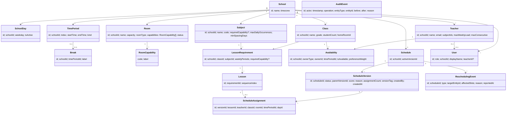
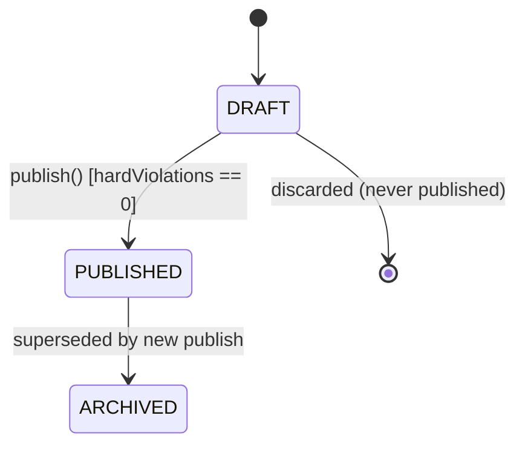
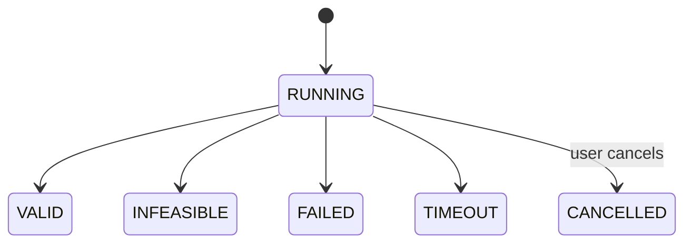
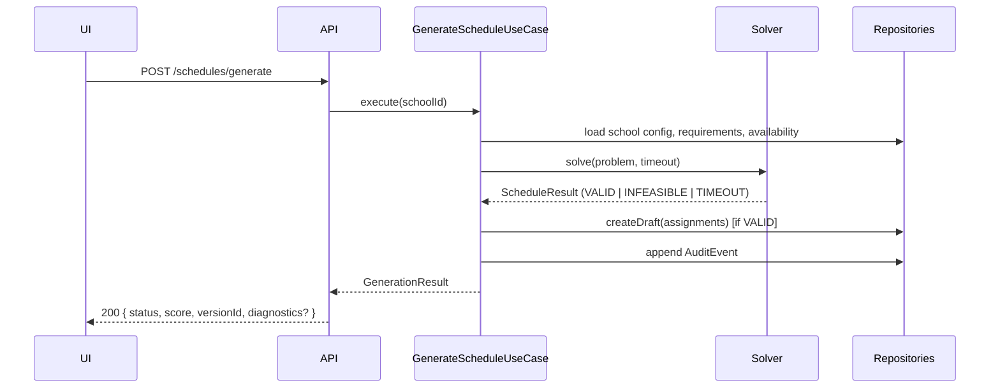
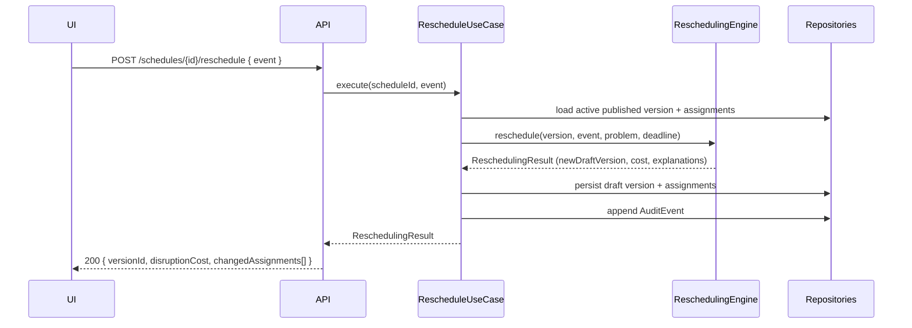
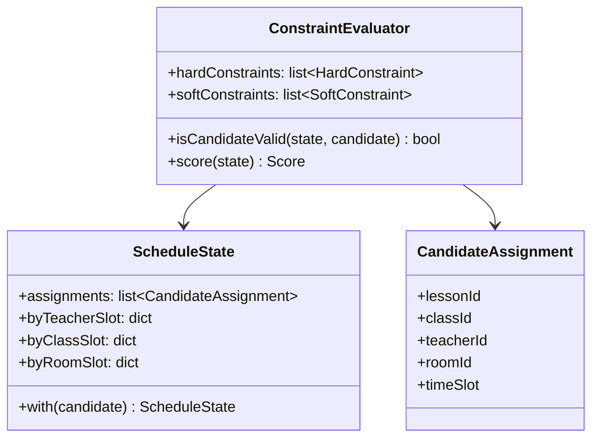

# 04-DESIGN.md — Software Design Document

This document defines the domain model, algorithms, and component-level design implementing [03-ARCHITECTURE.md](03-ARCHITECTURE.md). It uses pseudocode, not implementation code (Part 30 of the master prompt).

## 1. Domain Model



## 2. Entity Definitions

- **School** — root aggregate boundary for all configuration.
- **SchoolDay** — an active weekday (allows non-uniform weeks, e.g., a school closed Fridays).
- **TimePeriod** — an ordered slot in the day with start/end time and `kind` (`LESSON` or `BREAK`); breaks are periods, not a separate schedule dimension (Part 15/HC-007).
- **Room** — physical/schedulable space with `capacity`, a descriptive `roomType`, and a set of `RoomCapability` codes.
- **RoomCapability** — a tag (e.g., `CHEMISTRY_LAB`, `PROJECTOR`) — the only mechanism linking subjects to rooms (no hardcoded subject↔room mapping, per master prompt §55/§15).
- **Teacher** — staff member with subjects they can teach, workload limits, and `Availability` records.
- **Class** — a student group (7A, 8B, …) with a home room and `Availability` records.
- **Subject** — a teachable subject with weekly period requirement defaults and scheduling rules (spacing, daily max).
- **LessonRequirement** — "this Class needs this many weekly periods of this Subject," optionally demanding a `RoomCapability`.
- **Lesson** — one schedulable instance expanded from a `LessonRequirement` (e.g., "Math lesson 3 of 5 for 7A"); unplaced until it has a `ScheduleAssignment` in a given version.
- **Availability** — per-owner (teacher or class), per-`TimePeriod` flag (`isAvailable`) plus an optional `preferenceWeight` for soft-constraint scoring.
- **Constraint** — configuration record for a constraint's parameters/weight (not an entity with independent identity beyond configuration — see §10).
- **Preference** — modeled as `Availability.preferenceWeight` (per teacher/class, per period); not a separate top-level entity, and no soft constraint in this project's SC-001..SC-010 set requires a subject-level preference field.
- **Schedule** — one per school; points at the currently active (published) `ScheduleVersion`.
- **ScheduleVersion** — an immutable-once-published snapshot with `status` (`DRAFT`/`PUBLISHED`/`ARCHIVED`), a `score`, lineage (`parentVersionId`), a human-readable `reason`, a denormalized `assignmentCount`, and a `versionTag` used for optimistic concurrency (§30, docs/05-DATABASE.md §13).
- **ScheduleAssignment** — the placement of one `Lesson` at one `TimePeriod`/day, with a `teacherId` and `roomId`, within one `ScheduleVersion`.
- **ReschedulingEvent** — a recorded disruption (teacher unavailable, room closed, requirement added/removed) that triggers a rescheduling run.
- **AuditEvent** — an immutable log record of a significant mutation.
- **User** — the backend's authorization identity, keyed by Firebase Auth UID, carrying a `role` (`ADMIN`/`TEACHER`) and, for teachers, a link to their `Teacher` entity (docs/05-DATABASE.md §22).

## 3. Value Objects

- `TimeSlot` = `(dayId, timePeriodId)` — the atomic scheduling coordinate; immutable, compared by value.
- `Score` = `(hardViolations: int, softPenalty: float, breakdown: list[PenaltyContribution])` — immutable result of evaluation.
- `Violation` = `(constraintId, severity, message, involvedEntities)`.
- `DisruptionCost` = `(movedAssignments, changedRooms, changedTeachers, softPenaltyDelta, total)`.

## 4. Aggregates

- **School aggregate**: School + its config (days, periods, breaks, rooms, teachers, classes, subjects, lesson requirements, availability). Consistency boundary for configuration edits.
- **ScheduleVersion aggregate**: a version + its assignments subcollection. Consistency boundary for schedule mutation — a manual move or rescheduling run touches assignments only within one version at a time.

Aggregates never span both boundaries in a single transaction except where explicitly noted (publish: version status change + Schedule.activeVersionId update, see §21).

## 5. Domain Services

- `ConstraintEvaluator` — evaluates hard/soft constraints against a schedule state (§10–12).
- `ExplanationBuilder` — turns solver decisions/rejections into structured `Explanation` objects (§20 in ARCHITECTURE).
- `InfeasibilityAnalyzer` — bottleneck analysis over unplaced lessons (§19).
- `DisruptionCostCalculator` — computes `DisruptionCost` between two versions (§17).

## 6. Application Services

- `GenerateScheduleUseCase`, `RescheduleUseCase`, `ValidateMoveUseCase`, `ApplyMoveUseCase`, `PublishScheduleUseCase`, `CompareVersionsUseCase`, `RecordAvailabilityUseCase`. Each: load aggregate(s) via repository, call a domain service/engine, persist, emit `AuditEvent` — see §31 for transaction boundaries.

## 7. Interfaces

```text
interface TeacherRepository:
    get(id) -> Teacher | None
    list(schoolId) -> list[Teacher]
    save(teacher) -> None

interface ScheduleVersionRepository:
    get(scheduleId, versionId) -> ScheduleVersion | None
    listAssignments(scheduleId, versionId) -> list[ScheduleAssignment]
    createDraft(scheduleId, assignments, parentVersionId) -> ScheduleVersion
    applyAssignmentChange(scheduleId, versionId, change, expectedVersionTag) -> None  # optimistic concurrency
    publish(scheduleId, versionId, expectedVersionTag) -> None

interface AuditRepository:
    append(event: AuditEvent) -> None
```

(Analogous repositories exist for Class, Subject, Room, Availability, ReschedulingEvent.) All interfaces are defined in `domain`/`application`; implementations live in `infrastructure` (Architecture §7).

## 8. Repository Abstractions

Repositories return/accept domain entities, never Firestore document snapshots — the mapping between Firestore documents and domain entities happens entirely inside the repository implementation (Architecture §12).

## 9. Scheduling Model

```text
SchedulingProblem:
    school: School
    lessons: list[Lesson]              # expanded from LessonRequirements
    timeSlots: list[TimeSlot]          # cartesian product of active SchoolDays x LESSON-kind TimePeriods
    teachers: list[Teacher]
    rooms: list[Room]
    hardConstraints: list[HardConstraint]
    softConstraints: list[SoftConstraint]
    config: SchedulingConfig           # weights, timeout, random seed
```

## 10. Constraint Model

```text
interface HardConstraint:
    id: str
    isSatisfied(state: ScheduleState, candidate: CandidateAssignment) -> bool
    explainViolation(state, candidate) -> Violation

interface SoftConstraint:
    id: str
    weight: float
    penalty(state: ScheduleState) -> float
    explain(state: ScheduleState) -> list[PenaltyContribution]
```

`ScheduleState` = the set of `ScheduleAssignment`s made so far in the current search/version, plus fast-lookup indexes (by teacher+slot, by class+slot, by room+slot) used for O(1) conflict checks.

## 11. Hard Constraint Evaluation

Each `HardConstraint` implementation maps directly to a PRD requirement:

| Constraint class | PRD ID | Check |
|---|---|---|
| `TeacherConflictConstraint` | HC-001 | No existing assignment for `candidate.teacherId` at `candidate.timeSlot`. |
| `ClassConflictConstraint` | HC-002 | No existing assignment for `candidate.classId` at `candidate.timeSlot`. |
| `RoomConflictConstraint` | HC-003 | No existing assignment for `candidate.roomId` at `candidate.timeSlot`. |
| `RoomCapabilityConstraint` | HC-004 | `lesson.requiredCapability in room.capabilities` (or no requirement). |
| `TeacherAvailabilityConstraint` | HC-005 | `Availability(teacher, candidate.timeSlot).isAvailable`. |
| `ClassAvailabilityConstraint` | HC-006 | `Availability(class, candidate.timeSlot).isAvailable`. |
| `BreakConstraint` | HC-007 | `timePeriod.kind != BREAK`. |
| `WeeklyRequirementConstraint` | HC-008 | Checked post-search: every `LessonRequirement`'s lessons are all placed. |
| `RoomCapacityConstraint` | HC-009 | `class.studentCount <= room.capacity`. |

`ConstraintEvaluator.isCandidateValid(state, candidate)` short-circuits on the first violated constraint (cheapest checks — index lookups for HC-001..003 — ordered first) and returns the `Violation` for explanation.

## 12. Soft Constraint Evaluation

Each `SoftConstraint` contributes a weighted penalty; total soft penalty = Σ(weight × normalizedPenalty). Weights come from `SchedulingConfig` (persisted, editable by admins — see [05-DATABASE.md](05-DATABASE.md)), never hardcoded per class.

| Constraint class | PRD ID |
|---|---|
| `TeacherPreferredPeriodConstraint` | SC-001 |
| `TeacherPreferredDayConstraint` | SC-002 |
| `TeacherGapConstraint` | SC-003 |
| `SubjectDistributionConstraint` | SC-004 |
| `ConsecutiveLessonConstraint` | SC-005 |
| `ClassWorkloadBalanceConstraint` | SC-006 |
| `HomeRoomPreferenceConstraint` | SC-007 |
| `ResourceUtilizationConstraint` | SC-008 |
| `DisruptionMinimizationConstraint` | SC-009 (rescheduling only) |
| `PreservationConstraint` | SC-010 |

## 13. Scoring Model

```text
Score.hardViolations := count of HC violations in the final state (must be 0 for VALID)
Score.softPenalty    := Σ over SoftConstraints of (weight_i * penalty_i(state))
Score.quality         := 100 * exp(-k * softPenalty / lessonCount)   # bounded (0,100], monotonically decreasing, k configurable
```

**Decision — `quality` decays on the AVERAGE per-lesson penalty, not the raw total.** `softPenalty` is a sum across every lesson/teacher/class in the schedule, so it scales with school size. Measured against the Small/Medium/Large benchmark scenarios ([03-ARCHITECTURE.md](03-ARCHITECTURE.md) §30), a single `k` applied to the raw total made `quality` collapse to effectively 0 for any realistically imperfect multi-hundred-lesson schedule (e.g. Small: penalty 212 → quality 0.002) — a single-digit-of-precision-past-zero number is not an explainable figure. Dividing by `lessonCount` first makes `quality` reflect average badness per lesson, which stays comparable across school sizes for an equally-well-optimized schedule (all three benchmark sizes land around quality≈90 for the same generator+optimizer).

`quality` is a single explainable number for the UI; `breakdown` (per-constraint contributions) is always returned alongside it so no number is presented without justification (PRD §21 "no magic numbers").

## 14. Solver Model

```text
Solver.solve(problem: SchedulingProblem, timeoutSeconds: float) -> ScheduleResult:
    validate(problem)                      # structural pre-checks (FR-010)
    if not feasiblePreCheck(problem):
        return infeasible(InfeasibilityAnalyzer.analyze(problem))

    state := ScheduleState.empty()
    ordering := orderLessonsByMRVThenDegree(problem)   # §15
    result := backtrack(state, ordering, problem, deadline=now()+timeoutSeconds)

    if result is TIMEOUT: return timeoutResult(state)
    if result is FAILURE: return infeasible(InfeasibilityAnalyzer.analyze(problem, state))

    optimized := SimulatedAnnealingOptimizer.optimize(result.state, problem, deadline)
    return valid(optimized, Score.compute(optimized, problem))
```

This is the target end-state pipeline across both hard-constraint search and soft-constraint optimization. The two phases are built in separate implementation phases (master prompt: "Do not optimize before hard constraints are reliable") — the current `Solver.solve()` implements everything up to and including the backtracking search; the `optimize`/`Score.compute` steps are added once soft constraints exist. A Phase-4-only `ScheduleResult` therefore has no `score` field — see `app/domain/scheduling/result.py`.

## 15. Scheduling Algorithm

**Decision: Hybrid — Backtracking CSP with forward checking and MRV/degree/LCV heuristics for hard-constraint satisfaction, followed by Simulated Annealing local search for soft-constraint optimization.**

Rationale against the alternatives considered (master prompt §19/§21, Architecture §37):

| Approach | Verdict |
|---|---|
| Pure random/greedy generation | Rejected — cannot reliably satisfy hard constraints at realistic scale; not academically defensible as "the algorithm." |
| Pure local search (simulated annealing / genetic) from a random start | Rejected as the *sole* method — poor at reliably reaching a zero-hard-violation state quickly in a highly constrained space; hard constraints are better handled by systematic search with pruning. |
| Integer Programming (e.g., MILP via an external solver) | Rejected for this project — treats the hard part as a black box, undermining the goal of demonstrating and explaining a hand-built algorithm; also harder to adapt incrementally for rescheduling's "freeze most, repair some" mode. |
| Backtracking CSP alone (no optimization) | Rejected as the *sole* method — finds *a* valid schedule but ignores soft constraints entirely; quality would be arbitrary. |
| **Hybrid: CSP backtracking (hard) + local search (soft)** | **Selected** — CSP with forward checking reliably and explainably reaches a zero-violation state (or proves infeasibility); simulated annealing then improves quality without ever revisiting an invalid state, since every neighbor move is re-checked against hard constraints. The same two-phase structure repairs cleanly for rescheduling (§17): freeze most of the state, run the same backtracking search only over affected lessons, then re-optimize. |

**Pseudocode — MRV/degree lesson selection and LCV-ordered domains:**

A lesson's domain is candidate **time slots**, not the full (slot × teacher × room) cartesian product — a specific (teacher, room) pair is resolved lazily, only for the slot actually being tried (`resolvePlacement`, below), which keeps domain sizes bounded by slot count rather than slot count × teacher pool × room pool. This is what makes the per-step cost in the complexity analysis (§29) tractable at realistic scale.

```text
buildLessonDomains(problem):
    for each lesson in problem.lessons:
        lesson.domain := candidateSlots(lesson, problem)   # slots not pre-excluded by availability/breaks
    return lessons   # order does not matter here — selection below is dynamic

degree(lesson, allLessons, problem):
    # lessons sharing this lesson's Class are its most direct competitors
    # for the class's limited weekly slots — a static property, computed
    # once regardless of how many times selectNextLesson is called.
    return count of other lessons in allLessons whose requirement.classId == lesson.requirement.classId

selectNextLesson(remaining, degrees):                  # MRV, re-evaluated at every step
    return the lesson in `remaining` with the smallest current domain size,
           ties broken by the higher precomputed degree(lesson)
```

**Decision — MRV is dynamic, not computed once:** an earlier version of this design selected the lesson order once, before search began, and never revisited it. Measured against a 20-class/460-lesson benchmark scenario ([03-ARCHITECTURE.md](03-ARCHITECTURE.md) §30), that static ordering caused heavy thrashing (tens of thousands of candidates tried, tens of thousands of backtracks, still timing out) — a lesson that looked most-constrained from *initial* domain sizes is often not the most-constrained one anymore once several other lessons have been placed and forward checking has pruned everything. Re-selecting the most-constrained *remaining* lesson at every step (`selectNextLesson`, called once per search step, not once per search) eliminated the thrashing entirely (0 backtracks, same scenario). This is the standard, more effective form of MRV; a fixed a-priori ordering is a weaker approximation of it, not an equivalent implementation choice.

**Pseudocode — backtracking with forward checking:**

```text
backtrack(state, remaining, degrees, problem, deadline):
    if remaining is empty:
        return SUCCESS(state)
    if now() > deadline:
        return TIMEOUT(state)

    lesson, domain := selectNextLesson(remaining, degrees)
    rest := remaining minus (lesson, domain)
    candidates := leastConstrainingValueOrder(domain, rest)   # LCV heuristic, over TIME SLOTS

    for slot in candidates:
        candidate := resolvePlacement(lesson, slot, state)     # first free (teacher, room) at `slot`; see below
        if candidate is not None and ConstraintEvaluator.isCandidateValid(state, candidate):
            newState := state.with(candidate)
            prunedRest := forwardCheck(newState, rest, problem)   # None if any lesson's domain became empty
            if prunedRest is not None:
                result := backtrack(newState, prunedRest, degrees, problem, deadline)
                if result is SUCCESS or result is TIMEOUT:
                    return result
    return FAILURE

resolvePlacement(lesson, slot, state):
    # First-fit, not exhaustive: the first free (teacher, room) pair for
    # this lesson at this slot, checked via ScheduleState's O(1) indexes
    # (HC-001/002/003). If this specific pair is a dead end elsewhere, the
    # search backtracks to a DIFFERENT slot for this lesson, not to a
    # different resource pair for the same slot — a documented, small
    # completeness trade-off (a solution reachable only via a non-first
    # resource pick at some slot could be missed) for a large, measured
    # performance win.
    for teacher in eligibleTeachers(lesson.requirement):
        if teacher available at slot and not state.hasTeacherAt(teacher, slot):
            for room in eligibleRooms(lesson.requirement):
                if not state.hasRoomAt(room, slot):
                    return CandidateAssignment(lesson, teacher, room, slot)
    return None
```

The implementation runs this as an iterative search over an explicit stack, not native recursion — functionally identical to the pseudocode above, but immune to a language runtime's call-stack depth limit at a few hundred lessons deep (a real concern for the "Large" benchmark scenario). Backtracking needs no explicit "undo": `ScheduleState` and lesson domains are immutable (`state.with(candidate)` returns a new value), so a failed branch's derived state is simply discarded, never touched by its parent.

**Complexity:** worst case exponential in the number of lessons (as for any CSP), bounded in practice by forward checking (prunes doomed branches early) and dynamic MRV/degree selection (always attacks the most constrained remaining lesson). A configured `timeoutSeconds` guarantees termination (NFR-001/007); result is TIMEOUT rather than an unbounded hang. Forward checking re-validates every remaining lesson's full domain at every placement step, which is roughly O(lessons²) overall in the number of lessons — measured directly in [03-ARCHITECTURE.md](03-ARCHITECTURE.md) §30 (Large, at 2.5× Medium's lesson count, took roughly 10× longer to solve, not 2.5×). An incremental version that only re-examines domain entries a new assignment could plausibly affect would improve this, and is noted there as deferred, non-speculative future work rather than built ahead of a demonstrated need.

**Determinism:** all iteration orders (candidate lists, tie-breaks) are stable and, where randomness is used (simulated annealing's acceptance draws), seeded from `SchedulingConfig.randomSeed` — required for NFR-007 and for reproducible tests.

**Pseudocode — simulated annealing optimization phase:**

```text
SimulatedAnnealingOptimizer.optimize(state, problem, deadline):
    current := state
    currentPenalty := SoftScore.total(current, problem)
    temperature := problem.config.initialTemperature
    rng := seededRandom(problem.config.randomSeed)

    while now() < deadline and temperature > problem.config.minTemperature:
        move := randomNeighborMove(current, problem, rng)   # e.g., swap two assignments' slots
        candidateState := current.apply(move)
        if not allHardConstraintsSatisfied(candidateState, problem):
            continue                                          # never accept an invalid neighbor
        candidatePenalty := SoftScore.total(candidateState, problem)
        delta := candidatePenalty - currentPenalty
        if delta < 0 or rng.random() < exp(-delta / temperature):
            current, currentPenalty := candidateState, candidatePenalty
        temperature *= problem.config.coolingRate

    return current
```

## 16. Heuristics

- **MRV (Minimum Remaining Values):** schedule the most-constrained lesson (fewest legal slots) first — fails fast on infeasible branches.
- **Degree heuristic:** tie-break by how many other unplaced lessons share a teacher/class/room with this lesson — reduces future constraint propagation cost.
- **LCV (Least Constraining Value):** among a lesson's legal candidate slots, try first the one that eliminates the fewest options for other unplaced lessons.
- **Forward checking:** after each tentative assignment, prune the domains of unassigned lessons; if any domain becomes empty, backtrack immediately without recursing further.

## 17. Rescheduling Algorithm

```text
ReschedulingEngine.reschedule(scheduleVersion, event: ReschedulingEvent, problem, deadline):
    affected := identifyAffectedAssignments(scheduleVersion, event)
    # e.g., teacher-unavailable event -> all assignments for that teacher
    #       at the newly-unavailable slots, plus (transitively) any assignment
    #       that a repair candidate would conflict with.

    frozen := scheduleVersion.assignments - affected
    lessonsToRePlace := lessonsOf(affected)

    state := ScheduleState.fromFrozen(frozen)
    lessonDomains := buildLessonDomains(lessonsToRePlace, problem)
    searchResult := backtrack(state, lessonDomains, degrees, problem, deadline)   # same solver as §15

    if searchResult is FAILURE:
        return unrepairable(lessonsToRePlace, InfeasibilityAnalyzer.analyze(problem, state))

    repaired := searchResult.state
    optimized := SimulatedAnnealingOptimizer.optimize(
        repaired, problem,
        deadline,
        extraSoftConstraint = DisruptionMinimizationConstraint(baseline = scheduleVersion.assignments),
        frozenLessonIds = lessonsOf(frozen)   # see correction note below
    )

    cost := DisruptionCostCalculator.compute(scheduleVersion.assignments, optimized)
    newVersion := createDraftVersion(parent=scheduleVersion, assignments=optimized)
    return reschedulingResult(newVersion, cost, ExplanationBuilder.build(scheduleVersion, optimized))
```

*Correction found while implementing Phase 10's invariant tests:* the pseudocode above always passed the OPTIMIZER the full state (frozen assignments included, so scoring reflects the whole schedule), but the optimizer's own neighbor moves (swap/reassign-room) had no concept of "frozen" and could relocate a frozen assignment — `DisruptionMinimizationConstraint` only *penalizes* that, which simulated annealing can still accept with nonzero probability, so "frozen means frozen" wasn't actually guaranteed. Caught by a realistic-scale integration test (`tests/domain/rescheduling/test_engine_integration.py`) asserting every non-affected assignment is byte-for-byte unchanged after a repair — a small hand-built test hadn't been large enough to hit the bug. Fixed by having `SimulatedAnnealingOptimizer.optimize()` take the affected lessons' ids as `frozenLessonIds` and restrict both move types to that set; empty (full generation) by default.

**Disruption cost formulation (master prompt §24 / §"PART 22"):**

```text
DisruptionCost =
      movedAssignments            # count of lessons whose timeSlot changed
    + changedRooms                # count of lessons whose room changed
    + changedTeachers              # count of lessons whose teacher changed
    + softConstraintPenaltyDelta   # (new softPenalty - old softPenalty), floor 0
    + otherConfiguredPenalties     # e.g., a per-change fixed cost, from SchedulingConfig
```

The `DisruptionMinimizationConstraint` (SC-009) is injected into the optimizer's soft-constraint set specifically during rescheduling — it penalizes any assignment that differs from the pre-disruption baseline — so the local-search phase actively pulls the repaired schedule back toward the original wherever that doesn't conflict with hard constraints or other soft objectives (also see SC-010, `PreservationConstraint`, used identically during full regeneration when a prior published version exists).

**Why "freeze unaffected, repair the rest" rather than full regeneration:** regenerating from scratch would optimize globally but destroy stability guarantees (PRD Goal G5, SC-009); freezing preserves the invariant that only genuinely affected lessons can move, which is both the product requirement and what keeps the repair search small (far fewer lessons to place than a full generation).

**Implemented event types (Phase 9):** `TEACHER_UNAVAILABLE` and `ROOM_UNAVAILABLE` — both are structurally identical "this resource becomes unavailable at these slots" events, differing only in which assignment field (`teacherId` vs `roomId`) `identifyAffectedAssignments` filters on. `REQUIREMENT_ADDED`, `REQUIREMENT_REMOVED`, and `TEACHER_REPLACED` remain defined on `ReschedulingEventType` (extensibility point, per Edge Case Analysis below) but each needs meaningfully different handling — adding/removing lessons from the pool, or constraining a specific lesson's eligible teacher to exactly one id — rather than a straightforward "filter affected, repair the rest," so `ReschedulingEngine` raises a clear, typed error for them rather than silently mishandling a disruption it doesn't actually support (master prompt: no fake features). Building them out is future scope, not deferred by oversight.

`otherConfiguredPenalties` in the cost formula above is not implemented — no `SchedulingConfig` field motivates a per-change fixed cost today, so it's always 0 rather than an invented number.

## 18. Conflict Detection

Implemented once, as `ConstraintEvaluator.isCandidateValid` (§11), reused by:
1. The solver's backtracking loop (§15).
2. The rescheduling repair pass (§17).
3. `ValidateMoveUseCase` (manual editing) — evaluates a single proposed `CandidateAssignment` against the current `ScheduleState` of the target Draft version and returns `VALID` (no hard constraint fails, no soft constraint newly violated at a "warning" threshold), `WARNING` (valid but a configured soft-constraint threshold — e.g., a teacher's max-consecutive rule — is exceeded), or `INVALID` (a hard constraint fails, with the specific `Violation`).

## 19. Infeasibility Diagnostics

```text
InfeasibilityAnalyzer.analyze(problem, partialState=None):
    unplaced := lessons not present in partialState (or all lessons, for a pre-flight check)
    bottlenecks := {}
    for lesson in unplaced:
        requiredCapability := lesson.requirement.requiredCapability
        key := (requiredCapability, lesson.requirement.subjectId)
        available := countCompatibleFreeSlots(lesson, problem, partialState)
        bottlenecks[key].required += 1
        bottlenecks[key].availableSum += available

    report := []
    for key, agg in bottlenecks where agg.requiredExceedsAvailable():
        report.append(BottleneckReport(
            constraint = key,
            required = agg.required,
            available = agg.availableSum,
            shortage = agg.required - agg.availableSum,
            affectedClasses = classesInvolved(key, unplaced),
            affectedTeachers = teachersInvolved(key, unplaced),
        ))
    return InfeasibilityResult(bottlenecks = sortedBySeverity(report))
```

This directly produces the PRD FR-025 / master-prompt §22 style report (resource, required, available, shortage, affected classes).

## 20. Explanation Model

```text
Explanation:
    decision: str                 # e.g., "Lesson moved" / "Assignment chosen"
    original: CandidateAssignment | None
    selected: CandidateAssignment
    reason: str                    # e.g., "Teacher became unavailable Tuesday Period 3"
    alternativesConsidered: list[ (CandidateAssignment, rejectionReason: str) ]
    objectiveDelta: float
```

Built by `ExplanationBuilder` during the solver/rescheduling run (capturing rejected LCV candidates and why, per §15/§17) — never reconstructed after the fact from the frontend (Architecture §20).

## 21. Versioning

**Decision — hybrid, per-version snapshot with metadata (see Architecture §21, Database §"Versioning Strategy" for the full justification):**

```text
publish(scheduleId, versionId, expectedVersionTag):
    begin transaction:
        version := load(scheduleId, versionId)
        assert version.status == DRAFT
        assert version.hardViolations == 0                      # BR-005
        version.status := PUBLISHED
        schedule.activeVersionId := versionId
        previousActive := schedule.activeVersionId (pre-update)
        if previousActive: archive(previousActive)               # status := ARCHIVED
        append AuditEvent(operation="PUBLISH", ...)
    commit
```

Publishing is the only operation that touches both aggregates (`Schedule` and `ScheduleVersion`) — done in a single Firestore transaction (§31).

## 22. Audit

```text
AuditEvent:
    id, actor (userId, role), timestamp, operation (enum),
    entityType, entityId, before (json|null), after (json|null), reason (str|null)
```

Every application-layer use case that mutates state appends exactly one `AuditEvent` per logical operation, in the same transaction/batch as the mutation (never a best-effort side write).

## 23. Validation

Two validation layers, never duplicated:
1. **Schema validation** (Pydantic, at the API boundary) — types, required fields, ranges.
2. **Domain validation** (`ConstraintEvaluator`, application services) — business rules, hard constraints, cross-entity consistency (e.g., `LessonRequirement.requiredCapability` must exist among the school's defined `RoomCapability` codes).

## 24. Error Model

```text
DomainError (base)
├── ValidationError        -> 400
├── AuthenticationError     -> 401   # no/invalid/expired credential — not yet a known principal
├── ConflictError            -> 409   # e.g., manual move rejected
├── AuthorizationError      -> 403   # known principal, insufficient permission
├── NotFoundError            -> 404
├── SchedulingError          -> 422   # FAILED status from the solver
├── InfeasibleScheduleError -> 422   # INFEASIBLE status, carries InfeasibilityResult
├── ReschedulingError        -> 422   # unrepairable event
└── ConcurrencyError         -> 409   # optimistic concurrency check failed
```

API layer maps each to a structured JSON envelope `{ "error": { "type", "message", "details" } }`; unexpected exceptions are caught at the outermost middleware, logged with a correlation id, and returned as a generic 500 without internal detail (PRD §30, Architecture §27).

## 25. State Machines

**ScheduleVersion status:**



**Generation/Rescheduling job status:**



## 26. Sequence Diagrams

**Schedule generation:**



**Rescheduling:**



## 27. Class Diagrams

See §1 (domain model) and §10 (constraint interfaces). Additional solver-internal classes:



`CandidateAssignment` carries `classId` directly (not shown in the master prompt's original sketch) — without it, neither the class-conflict/class-availability constraints nor `ScheduleState`'s by-class-slot index could be computed without threading an extra lesson→class lookup through every consumer; `classId` is cheap to resolve once (from the `Lesson`/`LessonRequirement` it was expanded from) when a candidate is first constructed. `ScheduleState.assignments` holds `CandidateAssignment` entries, not persisted `ScheduleAssignment` records — during a search (or while validating a manual move), no `id`/`versionId` exists yet; those are minted only when a result is persisted (docs/05-DATABASE.md #16-17).

## 28. Pseudocode

See §14, §15, §17, §19 for the primary algorithms. All pseudocode above is normative for implementation — actual code should follow the same structure and naming closely enough to trace back to this document.

## 29. Complexity Analysis

| Algorithm | Time complexity | Notes |
|---|---|---|
| Backtracking CSP with forward checking | Worst-case O(d^n) (n=lessons, d=avg domain size); practically far lower due to MRV + forward checking pruning | Bounded by `timeoutSeconds`; returns TIMEOUT rather than completing worst case. |
| Forward checking domain update per assignment | O(remainingLessons × avgDomainSize) | Runs after every tentative assignment. |
| Simulated annealing pass | O(iterations × constraintEvaluationCost); iteration count bounded by deadline and cooling schedule | Each iteration only recomputes the delta for constraints touching the moved assignments (incremental scoring), not the full schedule. |
| Infeasibility bottleneck analysis | O(unplacedLessons × avgCandidateSlotCheck) | Runs once, only when needed. |
| Conflict check (single candidate) | O(1) amortized | Hash-indexed by (teacher, slot), (class, slot), (room, slot). |

## 30. Concurrency

- Multi-admin edits to the **same Draft version**: optimistic concurrency via a `versionTag` (monotonically incrementing integer) on the version document; every write includes the tag it read and the Firestore transaction aborts (→ `ConcurrencyError`) if the tag has changed (see [05-DATABASE.md](05-DATABASE.md) §"Concurrency").
- Generation/rescheduling jobs run as a single backend-owned async task per schedule; a second concurrent request for the same schedule is rejected with `ConflictError` (idempotency, §"Idempotency" below) rather than racing.

## 31. Transaction Boundaries

- Each application-layer use case is one Firestore transaction/batched write, or, for the (rare) multi-aggregate case (`publish`, §21), one explicit transaction spanning both the `Schedule` and `ScheduleVersion` documents.
- The solver/optimizer run itself is pure in-memory computation with **no** I/O mid-search; only the final result is persisted — this keeps the transaction short and avoids holding Firestore locks during a potentially multi-second search.

## 32. Design Patterns

- **Strategy** — `HardConstraint`/`SoftConstraint` implementations are interchangeable strategies registered into `ConstraintEvaluator`.
- **Repository** — all persistence access behind repository interfaces (§7–8).
- **Factory** — `SchedulingProblem` is assembled by a builder/factory from raw repository data, isolating the solver from Firestore's document shapes.
- **Template Method** — the backtracking search (§15) and the rescheduling repair (§17) share the same core search routine, parameterized by which lessons are frozen.
- **Observer-like progress reporting** — the async generation job publishes progress events consumed by the API layer for the UI's progress display (§"UX for Schedule Generation" cross-ref PRD/Architecture).

## 33. Extensibility

- New hard/soft constraints are added by implementing the `HardConstraint`/`SoftConstraint` interface and registering it — no change to the solver core.
- New room capabilities are pure data (`RoomCapability` codes) — no code change required to model a new lab type.
- New rescheduling event types extend `ReschedulingEvent.type` and are handled by `identifyAffectedAssignments` — the repair/optimize pipeline is unchanged.

## 34. Example Scenarios

Restated from PRD §15 as design-level traces:

- **Scenario 3 (lab shortage → INFEASIBLE):** `feasiblePreCheck` or the search's failure path invokes `InfeasibilityAnalyzer`, which aggregates all `CHEMISTRY_LAB`-requiring lessons, finds `required(20) > available(10)`, and returns a `BottleneckReport(shortage=10, affectedClasses=[7A,7B,8A])`.
- **Scenario 4 (teacher absence → repair):** a `ReschedulingEvent(type=TEACHER_UNAVAILABLE, targetEntityId=teacherId, affectedSlots=[...])` triggers `identifyAffectedAssignments` to select that teacher's assignments at the newly-unavailable slot(s); `frozen` = all other assignments; backtracking re-places only the affected lessons; `DisruptionMinimizationConstraint` steers the optimizer to keep other changes minimal. *Correction found while implementing Phase 9:* an earlier draft of this field (`effectiveFrom`, a calendar `date`) couldn't actually be resolved against the schedule — nothing else in the domain model has calendar dates, only recurring `Weekday`/`TimePeriod` slots — so it was replaced with `affectedSlots: TimeSlot[]` (plural, since a real disruption is often multi-period).

## Idempotency

Mutating operations that must not silently duplicate:
- `POST /schedules/generate` — requires a client-supplied `requestId`. *Implemented as replay, not rejection:* generation runs synchronously within the HTTP request (no background job queue exists — see docs/06-TECH_STACK.md), so the "in-flight duplicate job" race this section originally described cannot occur within one process; the only realistic duplicate is a client retrying after a dropped response. `GenerateScheduleUseCase` therefore checks the schedule's existing versions for a matching `requestId` and, if found, returns that SAME version instead of solving again — never a second draft, and never a `ConflictError` (there is no in-flight job to conflict with). `ScheduleVersion.requestId` persists the key for this lookup.
- `POST /schedules/{id}/reschedule` — same `requestId` pattern, scoped per `ReschedulingEvent`; Phase 9 scope, not yet built.
- Publishing is naturally idempotent at the domain level (publishing an already-published version is a no-op guarded by the status check in §21).
